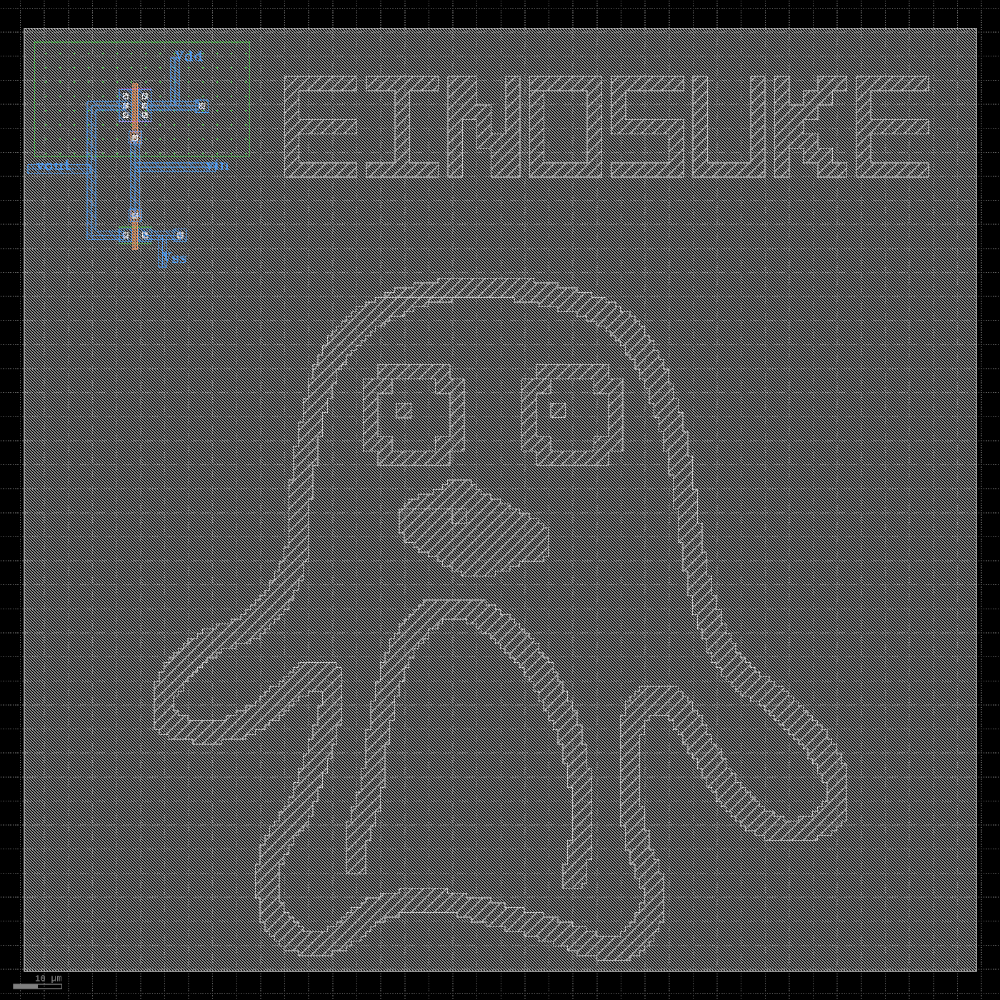

# OpenSUSI TR-1um Penguin Inverter

OpenSUSI TR-1um向けCMOSインバータと、Metal2で描いたペンギンのシリコンアートです。

## Full GDS layout

The image shows the complete `inverter` top cell. It was rendered directly by KLayout 0.30.9 with the TR-1um layer-properties file, including the native layer patterns, grid, and scale bar. The CMOS inverter is in the upper-left corner, and the penguin and `EINOSUKE` text are drawn on Metal2.

## Files

- `inverter.sch` — Xschem schematic
- `inverter.gds` — Layout and Metal2 artwork
- `inverter.png` — Full GDS layout image

## Layout

- Top cell: `inverter`
- Artwork layer: Metal2 (`20/0`)
- Metal2 artwork uses horizontal and vertical polygon edges only
- Includes the text `EINOSUKE`

## Verification

- TR-1um DRC: 0 violations
- TR-1um LVS: netlists match in strict port mode

The layout was verified with the OpenSUSI TR-1um KLayout DRC/LVS runsets.
